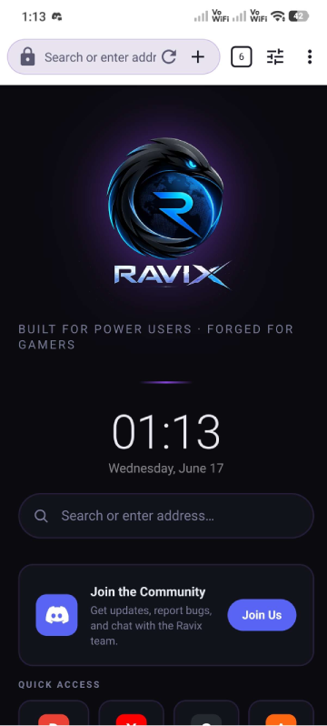
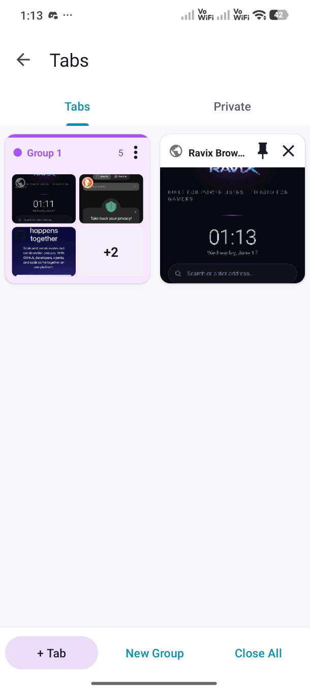
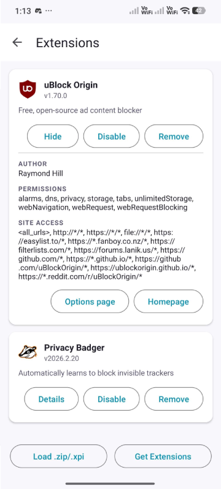
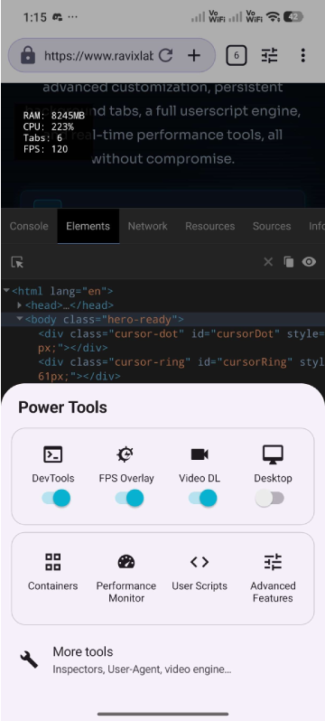

# Ravix Browser

> Fast, Private, Extensible — a power-user Android browser built on GeckoView (Firefox engine).

⚠️ **Status:** Active beta project focused on browser architecture, privacy features, and power-user tooling.

Ravix is a custom Android browser written in Kotlin and powered by Mozilla's GeckoView runtime. The project started as a personal exploration of browser architecture, extension systems, privacy tooling, and advanced Android development.

Rather than competing directly with Chrome or Firefox, Ravix serves as a learning platform for experimenting with browser technologies while implementing features commonly requested by power users, including WebExtensions, userscripts, advanced tab management, privacy controls, and developer tools.

## Architecture

Ravix follows a layered architecture centered around GeckoView.

- **UI Layer** handles browser interaction, tab management, settings, downloads, and extension management.
- **Application Layer** coordinates browser state through ViewModels, repositories, and session management.
- **Browser Engine Layer** integrates GeckoView for rendering, navigation, tab lifecycles, and extension execution.
- **Security Layer** provides encrypted storage, biometric authentication, and breach checking.
- **Extension Runtime** supports WebExtensions and Greasemonkey-style userscripts.
- **Persistence Layer** stores browser state, history, bookmarks, credentials, and settings using Room and SQLCipher.
- **System Integration Layer** connects Android Autofill, Downloads, Notifications, Billing, and Crash Reporting.
- 
## Highlights

* Firefox-based rendering via GeckoView
* Full WebExtension support
* Built-in userscript engine
* Advanced tab and session management
* Privacy and fingerprint protection
* Biometric-secured password manager
* Media downloading with yt-dlp integration
* Developer and power-user tooling

## Screenshots

| Browser                      | Tab Manager               |
| ---------------------------- | ------------------------- |
|  |  |

| Extensions                      | Power Tools                      |
| ------------------------------- | -------------------------------- |
|  |  |

## Why I Built It

Ravix began as a hobby project to better understand how modern browsers work beyond the rendering engine itself. The project explores:

* Browser session management
* Extension runtimes
* Userscript injection
* Secure local storage
* Android system integrations
* Performance optimization
* Mobile browser UX

The project continues to evolve as a platform for learning and experimentation.

---

## Features

### Core Browsing
- GeckoView (Firefox 150+/Nightly) rendering engine — full web standards support
- Tab groups with color-coded palettes and quick-switch strip
- Pinned tabs, private tabs, and parent–child tab relationships (popup windows)
- Desktop mode with per-site persistence across process death
- Pull-to-refresh, find-in-page, reader mode, fullscreen, and page zoom
- PWA install ("Install as App") via Web App Manifest detection
- Custom new-tab page with speed dial

### Extensions & User Scripts
- Full WebExtension (MV2) support via GeckoView's `webExtensionController`
- Install extensions from `.xpi`/`.zip` files sideloaded from local storage
- Automatic MV3 → MV2 conversion at import time for broad compatibility
- Script Injector with Greasemonkey-compatible API: `GM_getValue`, `GM_setValue`, `GM_addStyle`, `GM_xmlhttpRequest`
- Per-script URL pattern matching; scripts execute at `document_start` or `document_end`
- Built-in CodeMirror-based script editor with syntax highlighting
- Extension popup activity and per-extension enable/disable

### Privacy & Security
- **Fingerprint Protection** — per-session noise injected into Canvas 2D, WebGL, AudioContext, Navigator, Screen, fonts, Battery, Connection, and Permissions APIs
- **Biometric gate** on Password Manager (fingerprint / device credential)
- **SQLCipher AES-256** encrypted Room database for all browser data
- **HIBP integration** — checks saved passwords against Have I Been Pwned breach database
- EncryptedSharedPreferences for sensitive settings
- Private tabs with isolated GeckoView session

### Password Manager
- Built-in autofill service (`RavixAutofillService`) with `AccessibilityNodeInfo` structure parsing
- Biometric authentication required to view or autofill credentials
- Save-prompt bridge via JS↔Kotlin `document.title` tunnel with URL encoding

### Downloads
- Native download manager with pause/resume and progress notifications
- **yt-dlp integration** (youtubedl-android) — download video/audio from YouTube, Vimeo, and hundreds of other sites
- FFmpeg muxing for separate audio+video streams (YouTube)
- Media detector content script identifies streamable media on any page
- `MediaDownloadSheet` bottom sheet for one-tap video downloads

### Power Tools
- **Console Viewer** — live browser console logs, warnings, and errors
- **Storage Viewer** — inspect and edit `localStorage` / `sessionStorage` for any page
- **Performance Monitor** — real-time frame metrics
- **FPS Overlay** — persistent on-screen frame counter for gaming/media pages
- **CSS Injector** — inject custom CSS into any page per-session
- **DevTools bridge** via Eruda (full mobile devtools panel)
- User-Agent switcher (desktop/mobile/custom)
- Cookie Manager

### Tab Manager
- Grid and list views with real-time thumbnail and favicon updates via LiveData
- Drag-to-reorder tabs and groups
- Bulk close, group creation, and per-tab context actions
- Session persistence across process death with `GeckoSession` serialization

### Advanced & Settings
- Background Service toggle — keeps browser sessions alive when backgrounded
- Launcher icon picker (8 icon variants)
- Theme system (light/dark/system) with proper Material You colors
- Network security config (custom CA support)
- Data Transparency screen
- Firebase Crashlytics with R8 mapping upload for deobfuscated crash reports
- In-app update checker

### Ravix Pro
- Google Play Billing (billing-ktx 8.0.0) subscription gate
- Ko-fi / Patreon donation integration for one-time supporters
- `PremiumGate` utility that checks subscription state before gating Pro features
  
---

## Tech Stack

| Layer | Library / Tool |
|---|---|
| Browser engine | GeckoView (Mozilla Firefox) |
| Language | Kotlin 2.1 / JVM 17 |
| Min SDK | Android 8.0 (API 26) |
| Target SDK | Android 16 (API 36) |
| Architecture | Single-Activity + multiple feature Activities, LiveData/ViewModel |
| Database | Room 2.7.1 + SQLCipher AES-256 |
| DI / KSP | KSP (Room compiler) |
| Image loading | Glide 4.16 |
| Video download | youtubedl-android 0.18.1 (yt-dlp + FFmpeg + Python runtime) |
| Billing | Google Play Billing 8.0 |
| Crash reporting | Firebase Crashlytics |
| Security | AndroidX Security Crypto, AndroidX Biometric, HIBP |
| NDK | CMake 4.1 / NDK 30 (arm64-v8a) |
| Build | Gradle 8, AGP 8.7, KSP |

---

## Project Structure

```
app/src/main/
├── java/com/ravix/browser/
│   ├── autofill/          # Android AutofillService integration
│   ├── billing/           # Google Play Billing + PremiumGate
│   ├── data/
│   │   ├── db/            # Room database, DAOs, SQLCipher setup
│   │   ├── model/         # Entities (tabs, groups, bookmarks, history, passwords…)
│   │   └── repository/    # BrowserRepository (single data source of truth)
│   ├── scripts/           # ScriptInjector, InjectionEngine, FingerprintProtection
│   ├── security/          # BiometricGate, HibpClient
│   ├── service/           # BrowserBackgroundService, YtDlpDownloadService, BootReceiver
│   ├── ui/
│   │   ├── BrowserActivity.kt     # Main browser UI (~800KB, core of the app)
│   │   ├── advanced/              # AdvancedFeaturesActivity
│   │   ├── bookmarks/
│   │   ├── diagnostics/           # LogViewerActivity
│   │   ├── downloads/
│   │   ├── editor/                # CodeEditorActivity (CodeMirror)
│   │   ├── extensions/            # ExtensionManagerActivity
│   │   ├── history/
│   │   ├── passwords/
│   │   ├── popup/                 # MediaDownloadSheet, RavenPopup
│   │   ├── power/                 # Power Tools suite
│   │   ├── scripts/               # ScriptManagerActivity, ScriptEditorActivity
│   │   ├── settings/
│   │   └── tabs/                  # TabManagerActivity, adapters
│   └── utils/             # BrowserViewModel, RavixLogger, YtDlpManager, etc.
├── assets/
│   ├── ravix-inject/      # Built-in WebExtension (background.js, content.js, Eruda)
│   ├── codemirror/        # Embedded code editor
│   ├── media_detector.js
│   └── newtab.html
└── cpp/
    └── ravix_native.cpp   # NDK bridge
```
---

## License

Source available for reference. All rights reserved — not licensed for redistribution or derivative works without permission.
